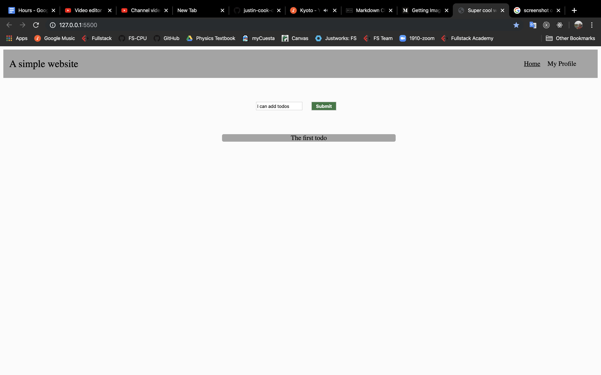

# Basic Todo List

**To open this file in view mode in VS Code, hover over the file name and click "Open Preview"**

## Description

The goal of this exercise will to be develop a basic webpage with a nav bar and todo list. The navbar will not perform any functionality and will be for display purposes only. The list will have a button which will add items to the list, with predetermined text content. By clicking on a list item you will be able to remove it from the list.

We will approach this exercise in two phases. The first phase will be CSS only, and will involve creating the layout you see in the screen shots. You are encouraged to follow the screenshots provided, but feel free to make it your own if you are comfortable doing so. Start with a few default items in the list. The second phase will be adding functionality to the list. This will involve wiring up the input and "Submit" button to add an item to the list. When you type into the input and hit submit, the text should appear in a list item and the input should clear. Also, removing an item from the list when it is clicked is a requirement. Hint: you will need to use `event.target.value` and `event.preventDefault()`. If you feel ambitious, you could create initial list items by mapping over an array of data and transforming it into list items when the page first loads.

---

---

## Approach

We will be working through these phases on different branches. Branches are different working versions of your codebase. The starting branch for the CSS phase will contain an empty index.html and style.css. The starting branch for the javascript phase will contain a filled out index.html and style.css with an empty index.js.

**NOTE: YOU MUST COMMIT BEFORE SWITCHING BRANCHES**

1. Run `git checkout CSS`: this will move you into the CSS phase branch
2. Attempt to create the ui from the screenshots. If you can't quite get it, you can check out the js phase branch for reference.
3. Once you are done with the CSS, it is time to add interactivity with JS. You can continue to work on the current branch or
4. If you want to start the JS phase with solution HTML and CSS, run `git checkout JS`
5. Once you are done, run `git checkout solution` to see the full solution
